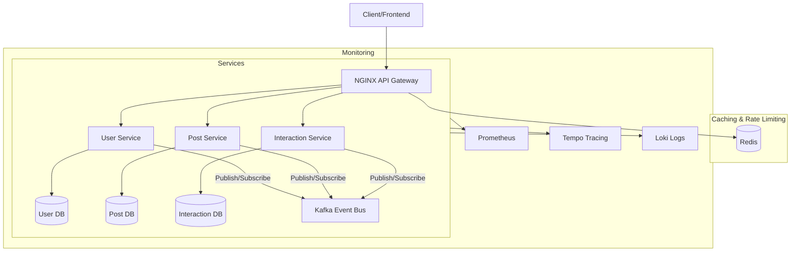

# Blogit - Microservices Blog Platform

A modern blog platform built with microservices architecture, focusing on scalability, resilience, and event-driven design.

## Architecture Overview



## Service Communication

### 1. Synchronous Communication (REST)
- NGINX handles routing and load balancing
- Circuit breakers protect services from cascading failures
- Redis for rate limiting and caching

### 2. Asynchronous Communication (Events)
- Kafka for event-driven communication
- Standardized event format across services
- Topics:
  - user-events: User-related events (registration, profile updates)
  - post-events: Post lifecycle events (creation, updates, deletion)
  - interaction-events: Likes, comments, and other interactions

### 3. Circuit Breaker Pattern
- Implemented using Resilience4j
- Protects services from:
  - Slow responses
  - Failed requests
  - Resource exhaustion

## Services

### User Service (Port: 8081)
- User management and authentication
- Profile management
- Following/Follower relationships

### Post Service (Port: 8082)
- Blog post CRUD operations
- Post categorization and tagging
- Draft management

### Interaction Service (Port: 8083)
- Likes and reactions
- Comments and replies
- User engagement metrics

## Event Types

### User Events
- USER_REGISTERED
- PROFILE_UPDATED
- FOLLOW_CREATED
- FOLLOW_REMOVED

### Post Events
- POST_CREATED
- POST_UPDATED
- POST_DELETED
- POST_PUBLISHED

### Interaction Events
- COMMENT_CREATED
- COMMENT_UPDATED
- COMMENT_DELETED
- LIKE_ADDED
- LIKE_REMOVED

## Getting Started

1. Prerequisites:
   - Docker and Docker Compose
   - Java 17+
   - Maven

2. Build and Run:
   ```bash
   cd blogit
   docker-compose up -d
   ```

3. Access Services:
   - API Gateway: http://localhost:8080
   - Swagger UI: http://localhost:8080/swagger-ui.html
   - Prometheus: http://localhost:9090
   - Grafana: http://localhost:3000

## Development

### Adding New Events
1. Create event class extending BaseEvent
2. Define event data class
3. Implement publisher in source service
4. Implement consumer in target service(s)

### Circuit Breaker Usage
```java
@CircuitBreaker(name = "userService")
public UserResponse getUser(String userId) {
    // Service call
}
```

### Kafka Producer Example
```java
@Autowired
private KafkaTemplate<String, DomainEvent<?>> kafkaTemplate;

public void publishEvent(DomainEvent<?> event) {
    kafkaTemplate.send(TOPIC_NAME, event);
}
```

### Kafka Consumer Example
```java
@KafkaListener(topics = "user-events")
public void handleUserEvent(DomainEvent<?> event) {
    // Handle event
}
```

## 📋 Prerequisites

- Java 17+
- Docker & Docker Compose
- Maven 3.8+
- PostgreSQL 14+
- Redis 7+
- Apache Kafka 3.0+

## 🏃‍♂️ Quick Start

1. **Clone and setup**:
   ```bash
   git clone <repository-url>
   cd blogit
   ```

2. **Start all microservices**:
   ```bash
   ./run.sh
   ```

5. **Access the API Gateway**:
   ```
   http://localhost:8080
   ```

## 📊 Service Ports

| Service | Port | Description |
|---------|------|-------------|
| User Service | 8081 | User management |
| Post Service | 8082 | Post operations |
| Interaction Service | 8083 | Likes, comments |

## 🗄️ Database Schema

Each service maintains its own database following the Database-per-Service pattern:

- `blogit_user_db` - User Service
- `blogit_post_db` - Post Service
- `blogit_interaction_db` - Interaction Service
- `blogit_notification_db` - Notification Service
- `blogit_media_db` - Media Service
- `blogit_feed_db` - Feed Service

## 🔐 Authentication

The platform uses JWT-based authentication:

1. Register/Login through User Service
2. Receive JWT token
3. Include token in `Authorization: Bearer <token>` header
4. API Gateway validates tokens and routes requests

## 📡 API Documentation

### User Service APIs
- `POST /api/users/register` - User registration
- `POST /api/users/login` - User login
- `GET /api/users/profile` - Get user profile
- `POST /api/users/follow/{userId}` - Follow user

### Post Service APIs
- `POST /api/posts` - Create post
- `GET /api/posts` - Get posts
- `PUT /api/posts/{id}` - Update post
- `DELETE /api/posts/{id}` - Delete post

### Interaction Service APIs
- `POST /api/interactions/like` - Like/unlike post
- `POST /api/interactions/comment` - Add comment
- `GET /api/interactions/post/{postId}` - Get post interactions

## 🎯 Key Features

### ✅ Implemented Features
- User registration and authentication
- Post creation and management
- Like/unlike functionality
- Comment system
- Follow/unfollow users
- Real-time notifications
- Media upload and processing
- Personalized feed generation

### 🔄 Event-Driven Architecture
Services communicate via Kafka events:
- `user.created` - New user registration
- `post.created` - New post published
- `post.liked` - Post liked/unliked
- `comment.added` - New comment
- `user.followed` - User followed

## 🏭 Production Considerations

### Scaling
- Horizontal scaling with Kubernetes
- Database read replicas
- Redis clustering
- Kafka partitioning

### Monitoring
- Health checks via Spring Actuator
- Distributed tracing with Zipkin
- Metrics collection with Micrometer
- Centralized logging

### Security
- JWT token validation
- Rate limiting
- Input validation
- SQL injection prevention
- CORS configuration

## 🧪 Testing

```bash
# Run unit tests
mvn test

# Run integration tests
mvn verify

# Run all tests
./test-all.sh
```

## 📈 Performance Optimization

- Redis caching for frequently accessed data
- Database connection pooling
- Async processing with Kafka
- CDN for media files
- Response pagination
- Query optimization

## 🔧 Development

### Adding New Service
1. Create service directory in project root
2. Add Spring Boot application
3. Configure database connection
4. Add to docker-compose.yml
5. Update API Gateway routes

### Local Development
```bash
# Start only infrastructure
docker-compose up -d postgres redis kafka

# Run services individually
cd user-service && mvn spring-boot:run
cd post-service && mvn spring-boot:run
```

## 🤝 Contributing

1. Fork the repository
2. Create feature branch
3. Commit changes
4. Push to branch
5. Create Pull Request

## 📞 Support

For issues and questions:
- GitHub Issues
