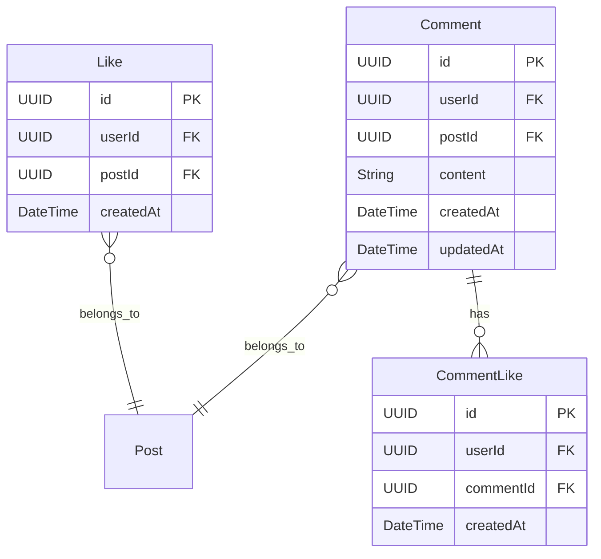

# Interaction Service

## Overview
The Interaction Service is designed to handle user interactions with posts, such as likes, comments, and other engagement features. It will integrate with PostgreSQL, Kafka, Redis, and OpenTelemetry, and will use Swagger for API documentation.

## Features
- Manage likes and comments on posts
- Provide real-time updates using Kafka
- Handle caching with Redis
- Expose RESTful APIs
- Integrated monitoring and tracing with OpenTelemetry

## Technology Stack
- Java Spring Boot
- PostgreSQL
- Kafka
- Redis
- OpenTelemetry
- Swagger

## Setup

### Build
```bash
mvn clean package -DskipTests
```

### Run Locally
```bash
java -jar target/interaction-service-1.0.0.jar
```

### Docker
#### Build Docker Image
```bash
docker build -t blogit-interaction-service .
```

#### Run with Docker Compose
Use the following command to start all services:
```bash
docker-compose up -d
```

## API Endpoints
Check the detailed API documentation at `/swagger-ui/index.html` after starting the service.

## Testing
HTTP request files for testing the endpoints using tools like Postman or HTTPie are located in the `http-requests` directory.

## Configuration
### Database
- Host: `postgres` (configured in `docker-compose.yml`)
- Port: `5432`
- Database: `blogit_db`

### Kafka
- Broker: `kafka:9092`
- Zookeeper: `zookeeper:2181`

### Redis
- Host: `redis`
- Port: `6379`

## Monitoring
Integrated with OpenTelemetry for distributed tracing and monitoring.

## Database Schema



### Table Relationships

1. **Like - Post** (Many-to-One)
   - Each Like belongs to one Post (through postId foreign key)
   - Each Like is associated with one User (through userId foreign key)
   - The postId references the Post table's id in the Post Service
   - The userId references the User table's id in the User Service

2. **Comment - Post** (Many-to-One)
   - Each Comment belongs to one Post (through postId foreign key)
   - Each Comment is associated with one User (through userId foreign key)
   - Comments can be liked by users through the CommentLike table

3. **CommentLike - Comment** (Many-to-One)
   - Each CommentLike belongs to one Comment (through commentId foreign key)
   - Each CommentLike is associated with one User (through userId foreign key)
   - Tracks which users have liked which comments

### Key Features
- All tables use UUID as primary keys for distributed system compatibility
- Foreign keys maintain referential integrity with User and Post services
- Timestamps track creation and updates
- Composite unique constraints prevent duplicate likes
- Cascading deletes ensure data consistency

## Build Instructions
1. Ensure Docker is running.
2. Run `docker-compose up` to start required infrastructure components.
3. Build with Maven: `mvn clean package`

## Usage
### Running the Service
Execute the JAR file created by Maven build:
```
java -jar target/interaction-service-0.0.1-SNAPSHOT.jar
```

## Contributing
Please fork the repository and create pull requests for new features or bug fixes.
