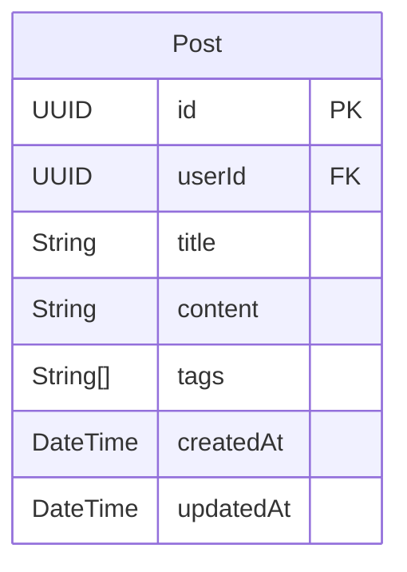

# Post Service

The Post Service is a microservice responsible for managing posts, content validation, hashtag extraction, and post analytics in the Blogit platform.

## Features

- ✅ Create, Read, Update, Delete Posts
- ✅ Post Visibility Controls (Public, Followers Only, Private)
- ✅ Content Validation
- ✅ Hashtag Support
- ✅ Media Attachment Support
- ✅ Post Analytics (Likes, Comments, Shares)
- ✅ Redis Caching
- ✅ Kafka Event Publishing
- ✅ PostgreSQL Database

## Technology Stack

- **Framework**: Spring Boot 3.3.1
- **Database**: PostgreSQL
- **Security**: JWT Integration
- **Caching**: Redis
- **Messaging**: Apache Kafka
- **Build Tool**: Maven
- **Java Version**: 17
- **Monitoring**: Prometheus, Zipkin

## API Endpoints

### Post Management Endpoints
- `POST /api/posts` - Create a new post
- `GET /api/posts/{postId}` - Get post by ID
- `GET /api/posts` - Get user's posts (paginated)
- `PUT /api/posts/{postId}` - Update a post
- `DELETE /api/posts/{postId}` - Delete a post (soft delete)

## Configuration

### Environment Variables

```env
# Database Configuration
SPRING_DATASOURCE_URL=jdbc:postgresql://localhost:5432/blogit_post_db
SPRING_DATASOURCE_USERNAME=blogit
SPRING_DATASOURCE_PASSWORD=blogit123

# Redis Configuration
SPRING_REDIS_HOST=localhost
SPRING_REDIS_PORT=6379

# Kafka Configuration
SPRING_KAFKA_BOOTSTRAP_SERVERS=localhost:9092

# JWT Configuration
APP_JWT_SECRET=mySecretKey
```

### Application Profiles

- **default**: Local development with local services
- **docker**: Docker environment with containerized services

## Building and Running

### Prerequisites
- Java 17+
- Maven 3.8+
- PostgreSQL 14+
- Redis 7+
- Apache Kafka

### Build
```bash
cd post-service
mvn clean package -DskipTests
```

### Run Locally
```bash
java -jar target/post-service-1.0.0.jar
```

### Run with Docker
```bash
# Build image
docker build -t blogit/post-service .

# Run container
docker run -p 8082:8082 --name post-service blogit/post-service
```

## Testing

### Run Unit Tests
```bash
mvn test
```

### Run Integration Tests
```bash
mvn integration-test
```

## API Usage Examples

### Create a New Post
```bash
curl -X POST http://localhost:8082/api/posts \
  -H "Content-Type: application/json" \
  -H "X-User-Id: 1" \
  -d '{
    "title": "My First Post",
    "content": "This is the content of my first post #hello #world",
    "visibility": "PUBLIC",
    "hashtags": ["hello", "world"]
  }'
```

### Get a Post
```bash
curl -X GET http://localhost:8082/api/posts/1
```

### Get User Posts (Paginated)
```bash
curl -X GET "http://localhost:8082/api/posts?page=0&size=10" \
  -H "X-User-Id: 1"
```

### Update a Post
```bash
curl -X PUT http://localhost:8082/api/posts/1 \
  -H "Content-Type: application/json" \
  -H "X-User-Id: 1" \
  -d '{
    "title": "Updated Post Title",
    "content": "Updated content",
    "visibility": "FOLLOWERS_ONLY"
  }'
```

### Delete a Post
```bash
curl -X DELETE http://localhost:8082/api/posts/1 \
  -H "X-User-Id: 1"
```

## Database Schema



### Table Relationships

1. **Post - User** (Many-to-One)
   - Each Post belongs to one User (through userId foreign key)
   - A User can have multiple Posts
   - The userId field references the User table's id in the User Service

### Key Features
- Each Post has a unique UUID as primary key
- Posts are associated with their author through userId
- Content supports rich text formatting
- Tags are stored as an array of strings for easy categorization
- Timestamps (createdAt, updatedAt) are automatically managed
- Soft deletion is supported to maintain data integrity with related interactions

## Post Visibility

The service supports three levels of post visibility:

- **PUBLIC**: Visible to everyone
- **FOLLOWERS_ONLY**: Visible only to followers
- **PRIVATE**: Visible only to the author

## Monitoring and Health Checks

### Health Check
```bash
curl http://localhost:8082/actuator/health
```

### Metrics
```bash
curl http://localhost:8082/actuator/metrics
```

### Prometheus Metrics
```bash
curl http://localhost:8082/actuator/prometheus
```

## Security

- JWT-based authentication (via X-User-Id header from API Gateway)
- Post ownership validation
- Content validation
- Request/Response validation

## Error Handling

The service provides comprehensive error handling with appropriate HTTP status codes:

- `400 Bad Request` - Validation errors
- `403 Forbidden` - Insufficient permissions
- `404 Not Found` - Post not found
- `500 Internal Server Error` - Server errors

## Contributing

1. Follow the existing code style
2. Write comprehensive tests
3. Update documentation
4. Ensure all tests pass before submitting
