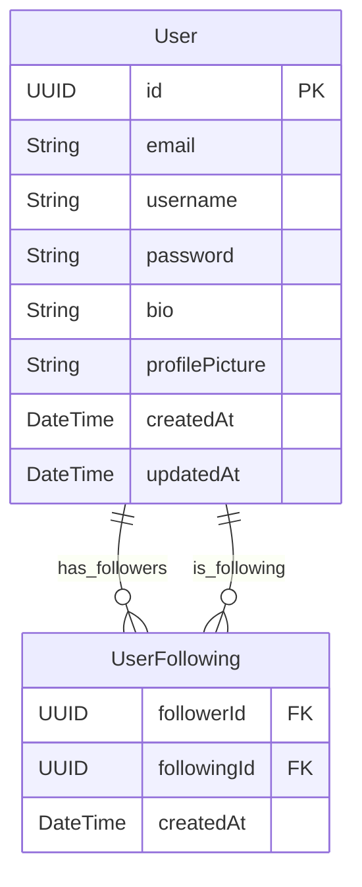

# User Service

The User Service is a microservice responsible for user management, authentication, and authorization in the Blogit platform.

## Features

- ✅ User Registration & Authentication
- ✅ JWT Token Management
- ✅ User Profile Management
- ✅ Follow/Unfollow System
- ✅ User Search
- ✅ Spring Security Integration
- ✅ Redis Caching
- ✅ Kafka Event Publishing
- ✅ Comprehensive Testing

## Technology Stack

- **Framework**: Spring Boot 3.3.1
- **Database**: PostgreSQL (H2 for testing)
- **Security**: Spring Security 6 with JWT
- **Caching**: Redis
- **Messaging**: Apache Kafka
- **Build Tool**: Maven
- **Java Version**: 17
- **Monitoring**: Prometheus, Zipkin

## API Endpoints

### Authentication Endpoints
- `POST /api/auth/register` - User registration
- `POST /api/auth/login` - User login

### User Management Endpoints
- `GET /api/users/me` - Get current user profile
- `PUT /api/users/me` - Update current user profile
- `GET /api/users/{userId}` - Get user by ID
- `GET /api/users/search?query={query}` - Search users

### Follow System Endpoints
- `POST /api/users/follow/{userId}` - Follow a user
- `DELETE /api/users/unfollow/{userId}` - Unfollow a user
- `GET /api/users/{userId}/followers` - Get user followers
- `GET /api/users/{userId}/following` - Get users followed by user

## Configuration

### Environment Variables

```env
# Database Configuration
SPRING_DATASOURCE_URL=jdbc:postgresql://localhost:5432/blogit_user_db
SPRING_DATASOURCE_USERNAME=blogit
SPRING_DATASOURCE_PASSWORD=blogit123

# Redis Configuration
SPRING_REDIS_HOST=localhost
SPRING_REDIS_PORT=6379

# Kafka Configuration
SPRING_KAFKA_BOOTSTRAP_SERVERS=localhost:9092

# JWT Configuration
APP_JWT_SECRET=mySecretKey
APP_JWT_EXPIRATION=86400000
```

### Application Profiles

- **default**: Local development with local services
- **docker**: Docker environment with containerized services

## Building and Running

### Prerequisites
- Java 17+
- Maven 3.8+
- PostgreSQL 14+
- Redis 7+
- Apache Kafka

### Build
```bash
cd user-service
mvn clean package -DskipTests
```

### Run Locally
```bash
java -jar target/user-service-1.0.0.jar
```

### Run with Docker
```bash
# Build image
docker build -t blogit/user-service .

# Run container
docker run -p 8081:8081 --name user-service blogit/user-service
```

## Testing

### Run Unit Tests
```bash
mvn test
```

### Run Integration Tests
```bash
mvn integration-test
```

## API Usage Examples

### Register a New User
```bash
curl -X POST http://localhost:8081/api/auth/register \
  -H "Content-Type: application/json" \
  -d '{
    "username": "johndoe",
    "email": "john@example.com",
    "password": "password123",
    "firstName": "John",
    "lastName": "Doe"
  }'
```

### Login
```bash
curl -X POST http://localhost:8081/api/auth/login \
  -H "Content-Type: application/json" \
  -d '{
    "usernameOrEmail": "johndoe",
    "password": "password123"
  }'
```

### Get Current User Profile
```bash
curl -X GET http://localhost:8081/api/users/me \
  -H "Authorization: Bearer {JWT_TOKEN}"
```

### Follow a User
```bash
curl -X POST http://localhost:8081/api/users/follow/2 \
  -H "Authorization: Bearer {JWT_TOKEN}"
```

### Search Users
```bash
curl -X GET "http://localhost:8081/api/users/search?query=john" \
  -H "Authorization: Bearer {JWT_TOKEN}"
```

## Database Schema



### Table Relationships

1. **User - UserFollowing** (Many-to-Many through UserFollowing)
   - A User can follow many other Users (through UserFollowing.followingId)
   - A User can have many followers (through UserFollowing.followerId)
   - The UserFollowing table serves as a junction table to establish these relationships
   - Both followerId and followingId reference the User table's id column

### Key Features
- Each User has a unique UUID as primary key
- Email and username are unique constraints
- Passwords are stored in encrypted format
- Timestamps (createdAt, updatedAt) are automatically managed
- The UserFollowing table tracks follower relationships with creation timestamp

## Monitoring and Health Checks

### Health Check
```bash
curl http://localhost:8081/actuator/health
```

### Metrics
```bash
curl http://localhost:8081/actuator/metrics
```

### Prometheus Metrics
```bash
curl http://localhost:8081/actuator/prometheus
```

## Security

- JWT-based authentication
- BCrypt password hashing
- CORS configuration
- Request/Response validation
- Rate limiting (via API Gateway)

## Error Handling

The service provides comprehensive error handling with appropriate HTTP status codes:

- `400 Bad Request` - Validation errors
- `401 Unauthorized` - Authentication required
- `403 Forbidden` - Insufficient permissions
- `404 Not Found` - Resource not found
- `409 Conflict` - Resource already exists
- `500 Internal Server Error` - Server errors

## Contributing

1. Follow the existing code style
2. Write comprehensive tests
3. Update documentation
4. Ensure all tests pass before submitting
